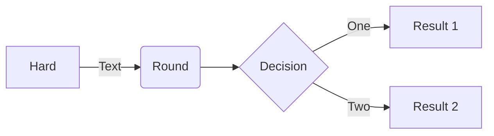
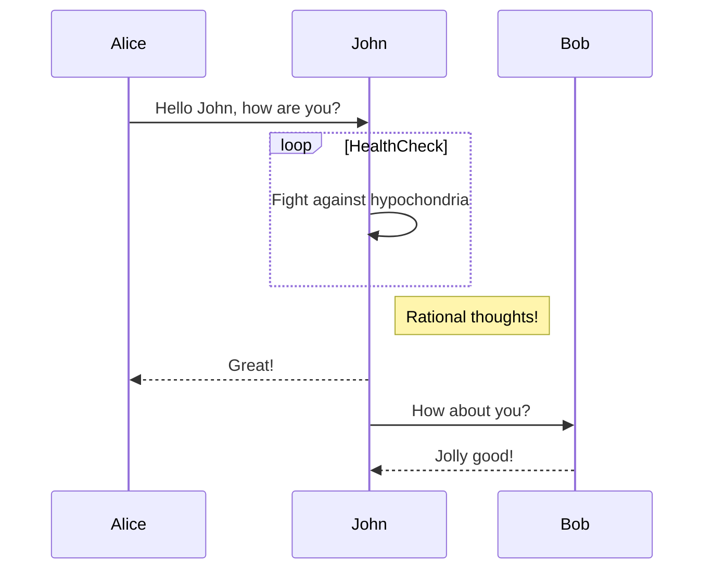

# B2C
This is a test

[Heading IDs](#custom-id)

.jpg)

#test


Heading level 1
===============

I just love **bold text**.

> Dorothy followed her through many of the beautiful rooms in her castle.

At the command prompt, type `nano`.

``Use `code` in your Markdown file.``

| Syntax      | Description |
| ----------- | ----------- |
| Header      | Title       |
| Paragraph   | Text        |

```
{
  "firstName": "John",
  "lastName": "Smith",
  "age": 25
}
```

```json
{
  "firstName": "John",
  "lastName": "Smith",
  "age": 25
}
```

<h3 id="custom-id">My Great Heading</h3>

- [x] Write the press release
- [ ] Update the website
- [ ] Contact the media

Gone camping! :tent: Be back soon.

That is so funny! :joy:

I need to highlight these ==very important words==.



